# Sistema de Gestion de una Courier - C++
Sistema de gestión de una Courier en lenguaje C++. Proyecto del **cuarto semestre** de estudios de Ingeniería Informática, presentado el **03/08/19**.

## Descripción

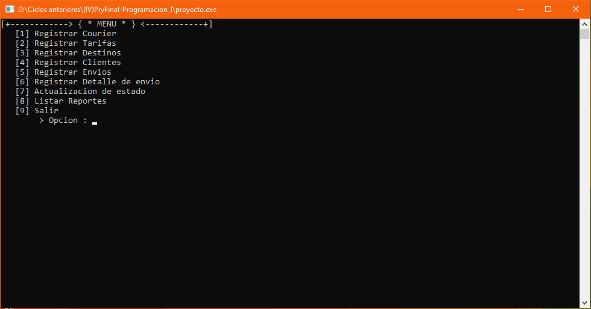

<strong>Imagen:</strong> Menú principal.

## Uso
1. [**Registrar Courier**](#registrar-courier)
2. [**Registrar Tarifas**](#registrar-tarifas)
3. [**Registrar Destinos**](#registrar-destinos)
4. [**Registrar Clientes**](#registrar-clientes)
5. [**Registrar Envíos**](#registrar-envíos)
6. [**Registrar Detalles de envío**](#registrar-detalles-de-envío)
7. [**Actualización de estado**](#actualización-de-estado)
8. [**Listar Reportes**](#listar-reportes)
    - [**Datos registrados**](#datos-registrados)
      - [Datos de la courier](#datos-de-la-courier)
      - [Listado de tarifas](#listado-de-tarifas)
      - [Listado de destinos](#listado-de-destinos)
      - [Listado de clientes](#listado-de-clientes)
      - [Listado de envíos](#listado-de-envíos)
    - [**Listar envíos**](#listar-envíos)
    - [**Listado de destinos según tipo**](#listado-de-destinos-según-tipo)
    - [**Listado de objetos según tipo de envío**](#listado-de-objetos-según-tipo-de-envío)
    - [**Listado de consignados según tipo de envío**](#listado-de-consignados-según-tipo-de-envío)
    - [**Estadística de objetos**](#estadística-de-objetos)
    - [**Simulación de boleta**](#simulación-de-boleta)
    - [**Consultar estado de envío**](#consultar-estado-de-envío)

## Registrar Courier
Registro de datos públicos para la Courier como: el nombre, departamento en el que se encuentra y la dirección del local en el que se ubica; adicional a esto se ingresan los datos de la empresa formal como: su nombre o razón social, el RUC, la dirección de esta empresa y una referencia.

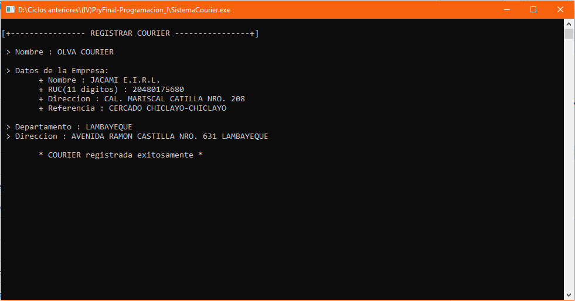

<strong>Imagen:</strong> Registro de la Courier.

## Registrar Tarifas
Registro de datos para una nueva tarifa que incluyen: el precio estándar que se cobra por envió y el precio adicional que se cobra por 1kg cuando el paquete supera el peso permitido en el precio estándar.

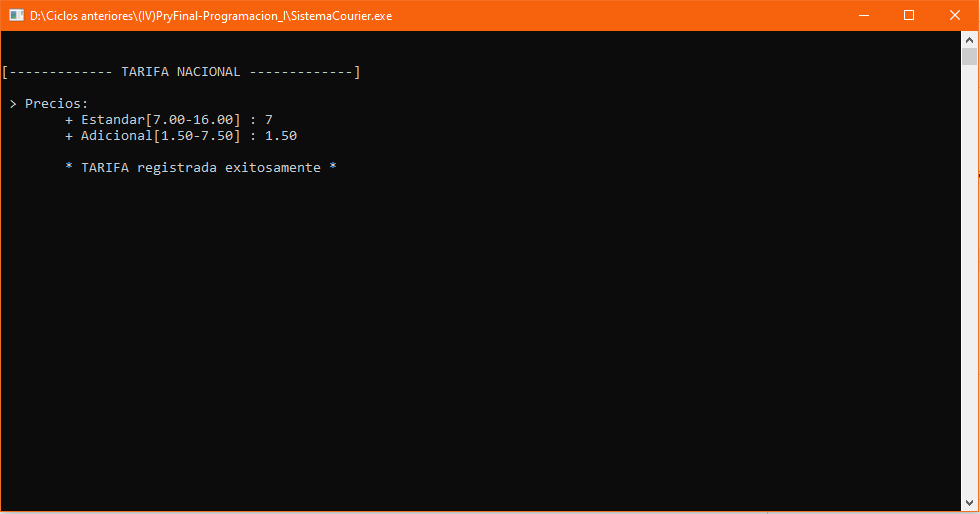

<strong>Imagen:</strong> Registro de una tarifa.

## Registrar Destinos
Registro de datos para un nuevo destino nacional o internacional, los datos de un destino nacional son: el departamento, la abreviatura de este departamento y la tarifa de envió a este departamento; los datos de un destino internacional son: el país, la abreviatura del país y el código postal, en los destinos internacionales no se incluye una tarifa ya que se maneja al realizar el proceso de envió.

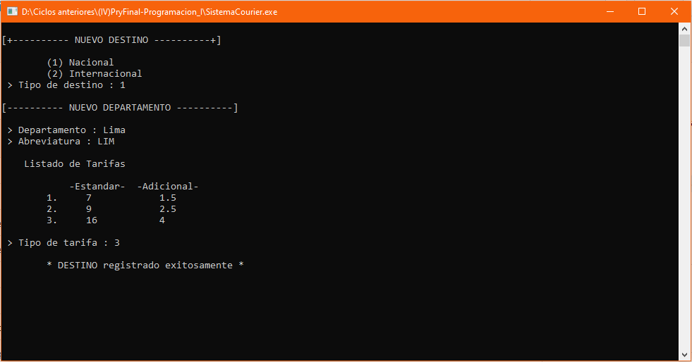

<strong>Imagen:</strong> Registro de un destino nacional.

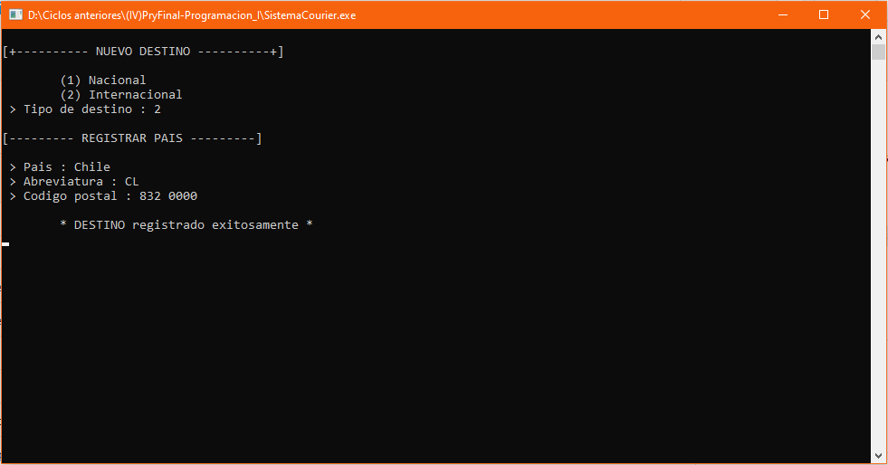

<strong>Imagen:</strong> Registro de un destino internacional.

## Registrar Clientes
Registro de datos para un nuevo cliente como: URL de su página web, DNI, nombre completo, dirección de su negocio, número telefónico y su dirección de correo electrónico de contacto; para realizar un envío no es necesario de un cliente ya que este registro es para clientes con un pequeño negocio que realicen envíos a todo el Perú, pudiendo contar con beneficios al realizar envíos constantes.

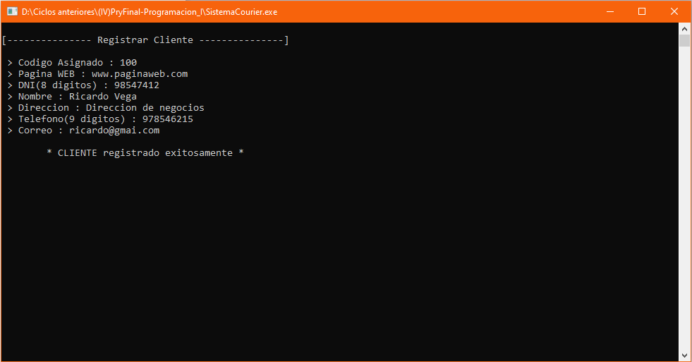

<strong>Imagen:</strong> Registro de un cliente.

## Registrar Envíos
Registro de datos para un nuevo envío **Regular**, **E-commerce**, **Internacional** o **Eventos**; y los siguientes datos: el nombre completo del dignatario, datos del remitente (DNI, nombre completo, dirección, teléfono y correo), destino de envío, cantidad de objetos, datos de cada objeto (peso y descripción) y los datos del consignado (DNI, nombre completo, dirección y teléfono).
Adicionalmente en los otros tipos de envío se tiene que: en **E-commerce** ya no se registra el remitente y solo se envía un objeto, en **Internacional** se ingresa el precio estándar y adicional también solo se envía un objeto, en **Eventos** se ingresa la cantidad de sobres o paquetes a enviar y se registra un consignado por cada sobre o paquete.

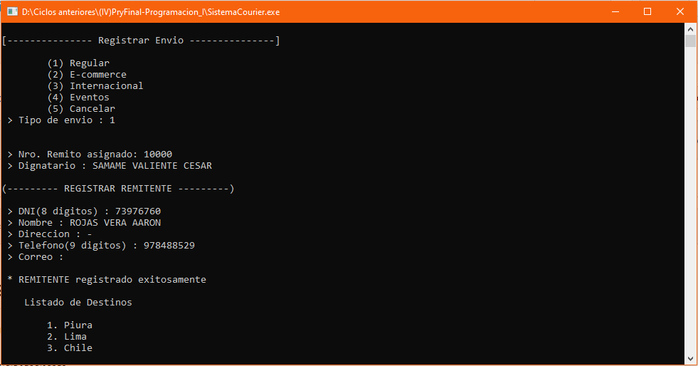

<strong>Imagen:</strong> Registoro de un envío <strong>Regular</strong>.

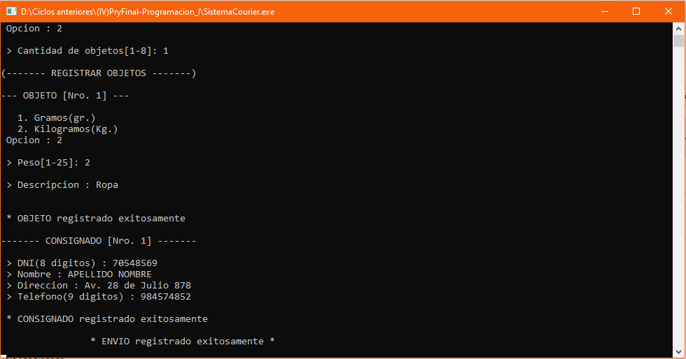

<strong>Imagen:</strong> Registro de un envío <strong>Regular</strong>.

## Registrar Detalles de envío
Registro de datos para un nuevo detalle de envío, primero se ingresa el número de remito del envío para verificar su existencia, si este es el caso se ingresan los siguientes datos: nombre del detalle y una pequeña descripción acerca de este detalle.

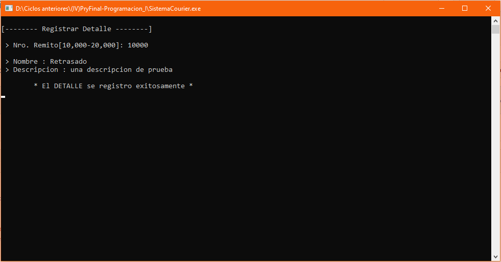

<strong>Imagen:</strong> Registro de un detalle a un envío.

## Actualización de estado
Registro del nuevo estado de un envío, primero se ingresa el número de remito del envío para verificar su existencia, si este es el caso muestra el siguiente estado que le corresponda y puedes registrarlo o no.

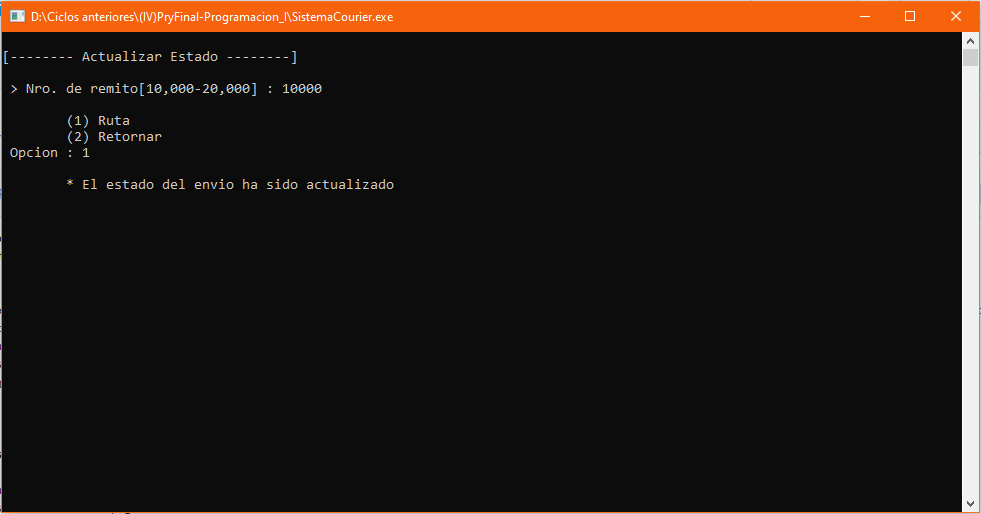

<strong>Imagen:</strong> Registro del nuevo estado del envío.

## Listar Reportes
Lista todos los reportes que se pueden efectuar los datos registrados previamente.

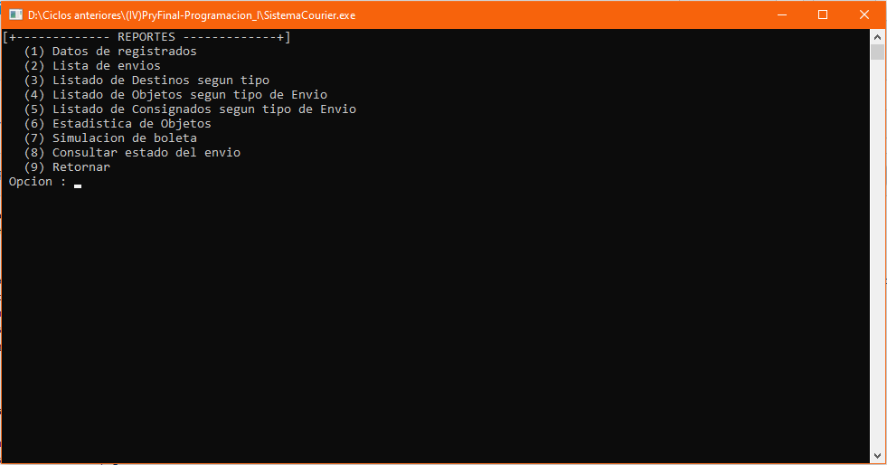

<strong>Imagen:</strong> Listado de los reportes.

### Datos registrados

#### Datos de la courier
#### Listado de tarifas
#### Listado de destinos
#### Listado de clientes
#### Listado de envíos

### Listar envíos
### Listado de destinos según tipo
### Listado de objetos según tipo de envío
### Listado de consignados según tipo de envío
### Estadística de objetos
### Simulación de boleta
### Consultar estado de envío

## Autores
- Ramirez Benites Rafael
- [Rojas Vera Aarón](https://github.com/Aaron-Shrike)
